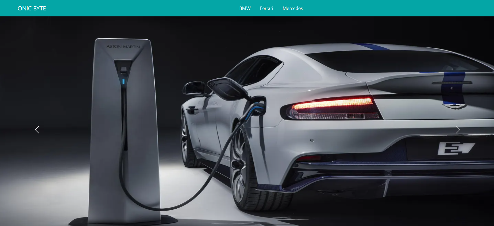

<!--Night Owl image-->

  

<!--Header Name-->
#  I'M Muhammad Abdul Haleem
  

<!--Start Intro-->               

👨‍💻 Full Stack Web Developer passionate about creating dynamic and engaging web applications. With expertise in HTML, CSS, Bootstrap, JavaScript, PHP, Laravel, MySQL, and Git, I transform ideas into seamless digital experiences. Let’s bring your vision to life!

◉ 🌐 Full stack web developer on a mission to create !

◉ 💻 Code is my canvas, and I’m painting the web one project at a time.

◉ 🚀 Always exploring new technologies to elevate my skills.

◉ 🎨 Design enthusiast who believes in the beauty of functionality.

◉ 🔍 Lifelong learner, because the web never stops evolving!

◉ 🤝 Collaboration fuels my creativity—let’s build something great together!

◉ 🌟 Passionate about turning ideas into impactful digital experiences.
<!--End Intro-->

<!--Github stats Table--> 
<h2 align="center">📊 Latest Projects 📊</h2>

<table width="100%">
  <tr>
    <td width="50%">
      <h3 align="center"><strong>Digital Trend</strong></h3>
      

        
      

    </td>
    <td width="50%">
      <h3 align="center"><strong>Cars Dealer</strong></h3>
      

        
      

    </td>
  </tr>
</table>
 

<!--Contact Section--> 
<!--
<h2 align="center">🤝 Cᴏɴɴᴇᴄᴛ Wɪᴛʜ Mᴇ 🤝 </h2>

  

 
-->
<!--Buy me a coffee-->
<!--

-->

<!--Footer--> 

  

